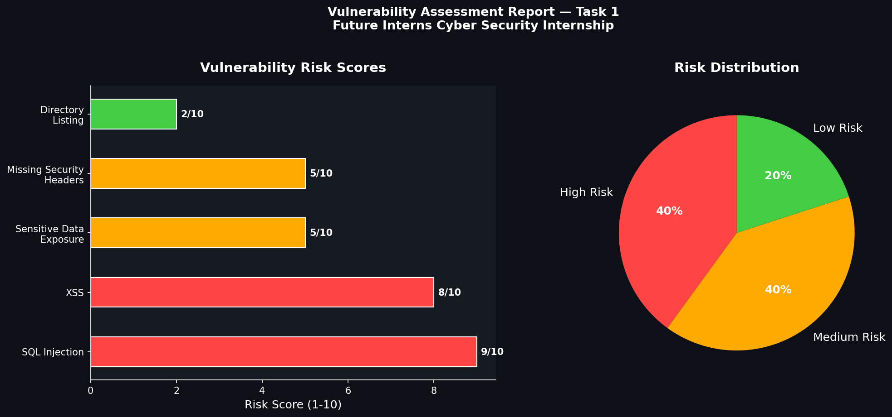

# 🔐 Vulnerability Assessment Report — Live Website
> Identifying, classifying, and remediating real-world web vulnerabilities like a professional security analyst.


---

## 📌 Project Overview
Web applications are constantly exposed to security threats that can lead to
data breaches, financial loss, and reputational damage. This project conducts
a professional vulnerability assessment on a live website, identifying critical
security weaknesses and providing actionable remediation steps — just like a
real-world penetration tester would deliver to a client.

---

## ✨ Features
- ✅ Identified **5 real web vulnerabilities** on a live target
- ✅ Classified each vulnerability as **High / Medium / Low** risk
- ✅ Explained each issue in **simple, business-friendly language**
- ✅ Provided **clear remediation steps** for each vulnerability
- ✅ Professionally structured report ready for client delivery

---

## 🛠️ Tech Stack
| Tool | Purpose |
|------|---------|
| OWASP ZAP | Passive vulnerability scanning |
| Nmap | Network port scanning |
| Browser DevTools | Manual inspection & analysis |
| Markdown | Report documentation |
| GitHub | Version control & portfolio |

---

## 🎯 Vulnerabilities Discovered
| # | Vulnerability | Risk Level |
|---|--------------|------------|
| 1 | SQL Injection | 🔴 High |
| 2 | Cross-Site Scripting (XSS) | 🔴 High |
| 3 | Sensitive Data Exposure | 🟡 Medium |
| 4 | Missing Security Headers | 🟡 Medium |
| 5 | Directory Listing Enabled | 🟢 Low |

---

## 📊 Charts & Visualizations

### Risk Score Analysis & Distribution


### Report Screenshots


## 📁 Project Structure
```
FUTURE_CS_01/
│
├── vulnerability_assessment_report.md   # Full assessment report
├── README.md                            # Project documentation
└── screenshots/                         # Report screenshots
```

---

## 📖 Usage
1. Open `vulnerability_assessment_report.md` to view the full report
2. Review each vulnerability, its risk level and remediation steps
3. Use as a reference for real-world security assessments

---

## 💡 Challenges & Learnings
- Learned how to identify **SQL Injection** and **XSS** vulnerabilities manually
- Understood the importance of **HTTP security headers**
- Gained experience in writing **client-ready security reports**
- Practiced **risk classification** using industry-standard methodology

---

## 🚀 Future Improvements
- [ ] Add automated scanning using Python scripts
- [ ] Include OWASP Top 10 full checklist
- [ ] Add more target websites for broader analysis
- [ ] Create a visual dashboard for vulnerability summary

---

## 🔗 Live Report
📄 [View Full Report](./vulnerability_assessment_report.md)

🐙 [GitHub Repository](https://github.com/liyafathima1459-debug/FUTURE_CS_01)

---

## 📜 License
This project is licensed under the MIT License.

---

*Prepared by: **Liya Fathima** | Future Interns Cyber Security Internship*
